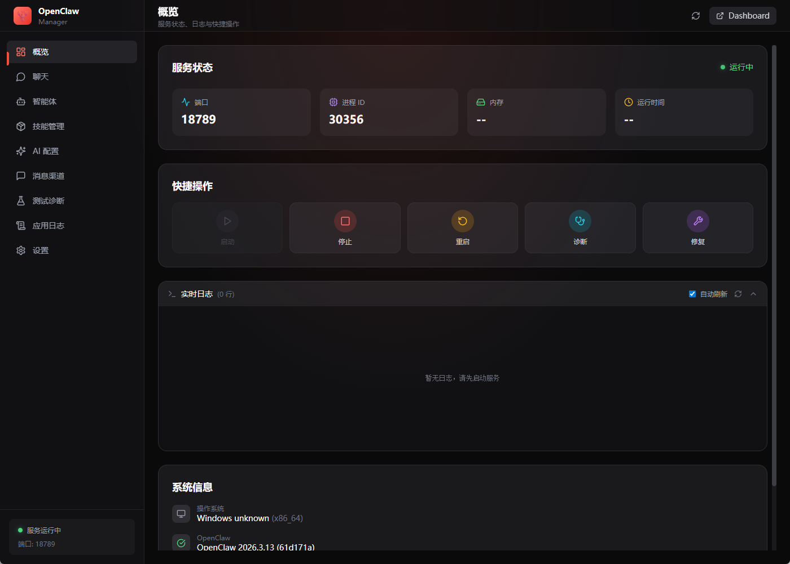
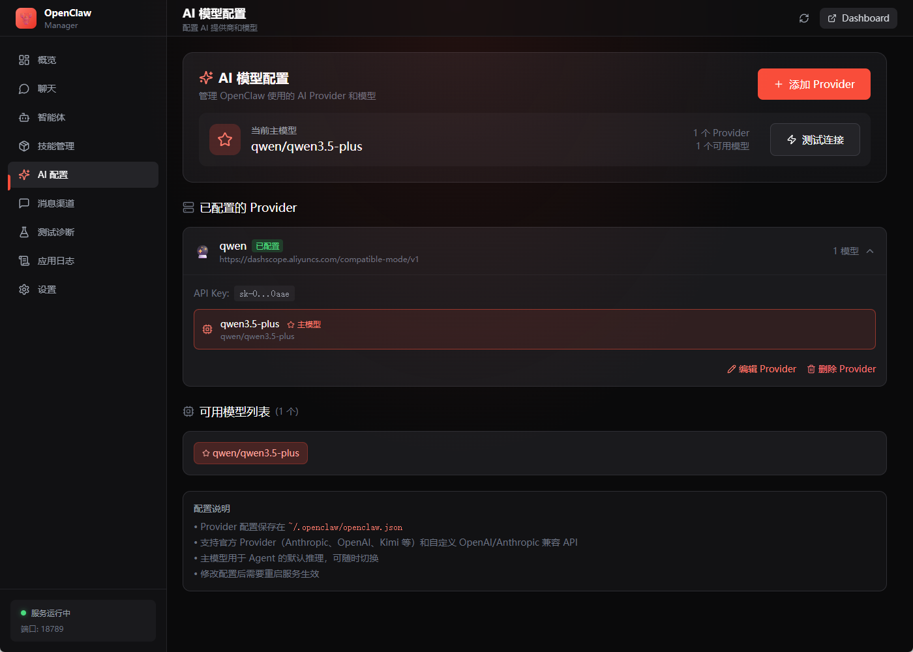
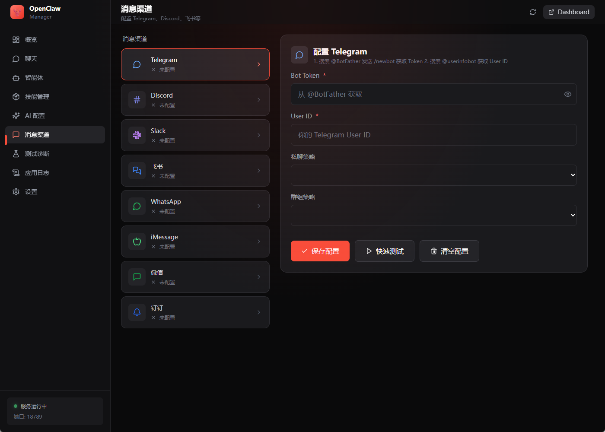
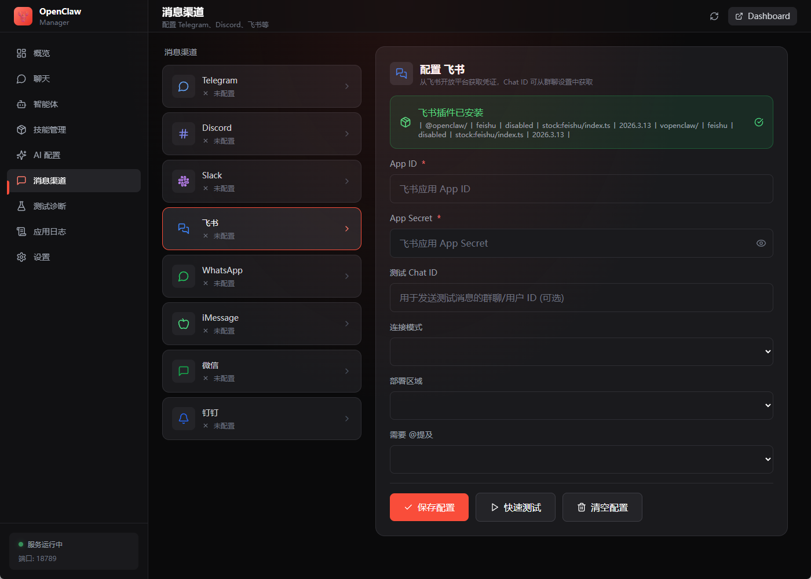

# 🦞 OTOClaw - 一键龙虾

> **OpenClaw 一键安装整合包** | *otoClaw = One-Touch OpenClaw*

**"点一下，装好整套龙虾 AI"**

高性能跨平台 AI 助手管理工具，基于 **Tauri 2.0 + Vue 3 + TypeScript + Rust** 构建。


🌐 **官方网站**: [otoclaw.com](https://otoclaw.com) - 下载服务 | 教程文档 | 社区交流

***

### 项目名称由来

- **OTOClaw** = **O**ne-**T**ouch **O**pen**Claw**
- 寓意：**一键部署，开箱即用**
- 中文名称：**一键龙虾**

***

## 📖 项目背景

**OTOClaw（一键龙虾）** 是一款面向 AI 助手管理场景的现代化桌面应用，基于 **Tauri 2.0 + Vue 3 + TypeScript + Rust** 技术栈构建。旨在提供跨平台（Windows/macOS/Linux）的 AI 助手可视化管理和一键部署解决方案。

项目在设计之初参考了 [OpenClaw Manager](https://github.com/miaoxworld/openclaw-manager) 的产品思路，但现已发展为独立架构：采用 Rust 原生后端实现高性能系统调用，前端使用 Vue 3 Composition API + Pinia 状态管理打造现代化响应式 UI，并扩展了智能体管理、内置聊天界面、技能系统等创新功能。

## 📸 界面预览

### 📊 仪表盘概览

实时监控服务状态，一键管理 AI 助手服务。



- 服务状态实时监控（端口、进程 ID、内存、运行时间）
- 快捷操作：启动 / 停止 / 重启 / 诊断
- 实时日志查看，支持自动刷新

***

### 🤖 AI 模型配置

灵活配置多个 AI 提供商，支持自定义 API 地址。



- 支持 14+ AI 提供商（Anthropic、OpenAI、DeepSeek、Moonshot、Gemini 等）
- 自定义 API 端点，兼容 OpenAI 格式的第三方服务
- 一键设置主模型，快速切换

***

### 📱 消息渠道配置

连接多种即时通讯平台，打造全渠道 AI 助手。

<table>
  <tr>
    <td width="50%">
      
      <p align="center"><b>Telegram Bot</b></p>
    </td>
    <td width="50%">
      
      <p align="center"><b>飞书机器人</b></p>
    </td>
  </tr>
</table>

- **Telegram** - Bot Token 配置、私聊/群组策略
- **飞书** - App ID/Secret、WebSocket 连接、多部署区域
- **企业微信** - 多账号管理、Bot ID/Secret、Agent API 配置
- **更多渠道** - Discord、Slack、WhatsApp、iMessage、钉钉

***

## ✨ 功能特性

| 模块           | 功能                                       |
| ------------ | ---------------------------------------- |
| 📊 **仪表盘**   | 实时服务状态监控、进程内存统计、一键启动/停止/重启               |
| 🤖 **AI 配置** | 14+ AI 提供商、自定义 API 地址、模型快速切换             |
| 🤖 **智能体管理** | 多智能体创建、独立工作区、渠道绑定 |
| 📥 **内置聊天界面** | 无需第三方工具即可直接对话测试 |
| 🧩 **技能系统** | 技能安装、配置、导出、依赖管理 |
| 🐳 **沙箱管理** | Docker 容器配置、安全策略可视化 |
| 📱 **消息渠道**  | Telegram、Discord、Slack、飞书、企业微信、iMessage、钉钉 |
| ⚡ **服务管理**   | 后台服务控制、实时日志、开机自启                         |
| 🧪 **测试诊断**  | 系统环境检查、AI 连接测试、渠道连通性测试                   |
| 🔄 **应用更新** | 内置更新检查与一键升级 |


## 🍎 macOS 常见问题

### "已损坏，无法打开" 错误

macOS 的 Gatekeeper 安全机制可能会阻止运行未签名的应用。解决方法：

**方法一：移除隔离属性（推荐）**

```bash
# 对 .app 文件执行
xattr -cr /Applications/OTOClaw.app

# 或者对 .dmg 文件执行（安装前）
xattr -cr ~/Downloads/OTOClaw.dmg
```

**方法二：通过系统偏好设置允许**

1. 打开 **系统偏好设置** > **隐私与安全性**
2. 在 "安全性" 部分找到被阻止的应用
3. 点击 **仍要打开**

**方法三：临时禁用 Gatekeeper（不推荐）**

```bash
# 禁用（需要管理员密码）
sudo spctl --master-disable

# 安装完成后重新启用
sudo spctl --master-enable
```

### 权限问题

如果应用无法正常访问文件或执行操作：

**授予完全磁盘访问权限**

1. 打开 **系统偏好设置** > **隐私与安全性** > **完全磁盘访问权限**
2. 点击锁图标解锁，添加 **OTOClaw**

**重置权限**

如果权限设置出现异常，可以尝试重置：

```bash
# 重置辅助功能权限数据库
sudo tccutil reset Accessibility

# 重置完全磁盘访问权限
sudo tccutil reset SystemPolicyAllFiles
```

## 🚀 快速开始

### 环境要求

- **Node.js** >= 22.0
- **Rust** >= 1.70
- **pnpm** (推荐) 或 npm

### macOS 额外依赖

```bash
xcode-select --install
```

### Windows 额外依赖

- [Microsoft C++ Build Tools](https://visualstudio.microsoft.com/visual-cpp-build-tools/)
- [WebView2](https://developer.microsoft.com/en-us/microsoft-edge/webview2/)

### Linux 额外依赖

```bash
# Ubuntu/Debian
sudo apt update
sudo apt install libwebkit2gtk-4.1-dev build-essential curl wget file libxdo-dev libssl-dev libayatana-appindicator3-dev librsvg2-dev

# Fedora
sudo dnf install webkit2gtk4.1-devel openssl-devel curl wget file libxdo-devel
```

### 安装与运行

```bash
# 克隆项目
git clone https://github.com/your-username/otoclaw.git
cd otoclaw

# 安装依赖
npm install

# 开发模式运行
npm run tauri:dev

# 构建发布版本
npm run tauri:build
```

## 📁 项目结构

```
otoclaw/
├── src-tauri/                 # Rust 后端
│   ├── src/
│   │   ├── main.rs            # 入口
│   │   ├── commands/          # Tauri Commands
│   │   │   ├── service.rs     # 服务管理
│   │   │   ├── config.rs      # 配置管理
│   │   │   ├── process.rs     # 进程管理
│   │   │   └── diagnostics.rs # 诊断功能
│   │   ├── models/            # 数据模型
│   │   └── utils/             # 工具函数
│   ├── Cargo.toml
│   └── tauri.conf.json
│
├── src/                       # Vue 3 前端
│   ├── App.vue                # 根组件
│   ├── main.ts                # 入口文件
│   ├── components/
│   │   ├── Layout/            # 布局组件
│   │   ├── Dashboard/         # 仪表盘
│   │   ├── AIConfig/          # AI 配置
│   │   ├── Channels/          # 渠道配置
│   │   ├── Testing/           # 测试诊断
│   │   ├── Logs/              # 日志查看
│   │   ├── Settings/          # 设置
│   │   └── Setup/             # 安装向导
│   ├── composables/           # 组合式函数
│   │   └── useService.ts      # 服务管理
│   ├── stores/                # Pinia 状态管理
│   │   └── appStore.ts
│   ├── lib/                   # 工具库
│   │   ├── tauri.ts           # Tauri API 封装
│   │   └── logger.ts          # 日志工具
│   └── styles/
│       └── globals.css
│
├── package.json
├── vite.config.ts
└── tailwind.config.js
```

## 🛠️ 技术栈

| 层级   | 技术              | 说明         |
| ---- | --------------- | ---------- |
| 前端框架 | Vue 3.5         | 用户界面       |
| 状态管理 | Pinia           | Vue 官方状态管理 |
| 样式   | TailwindCSS     | 原子化 CSS    |
| 动画   | @vueuse/motion  | Vue 动画库    |
| 图标   | Lucide Vue Next | 精美图标       |
| 后端   | Rust            | 高性能系统调用    |
| 跨平台  | Tauri 2.0       | 原生应用封装     |

## 📦 构建产物

运行 `npm run tauri:build` 后，会在 `src-tauri/target/release/bundle/` 生成：

| 平台      | 格式                  |
| ------- | ------------------- |
| macOS   | `.dmg`, `.app`      |
| Windows | `.msi`, `.exe`      |
| Linux   | `.deb`, `.AppImage` |

## 🎨 设计理念

- **暗色主题**：护眼舒适，适合长时间使用
- **现代 UI**：毛玻璃效果、流畅动画
- **响应式**：适配不同屏幕尺寸
- **高性能**：Rust 后端，极低内存占用

## 🔧 开发命令

```bash
# 开发模式（热重载）
npm run tauri:dev

# 仅运行前端
npm run dev

# 构建前端
npm run build

# 构建完整应用
npm run tauri:build

# 检查 Rust 代码
cd src-tauri && cargo check

# 运行 Rust 测试
cd src-tauri && cargo test
```

## 📝 配置说明

### Tauri 配置 (tauri.conf.json)

- `app.windows` - 窗口配置
- `bundle` - 打包配置
- `plugins.shell.scope` - Shell 命令白名单
- `plugins.fs.scope` - 文件访问白名单

### 环境变量

应用会读取 `~/.openclaw/env` 中的环境变量配置。

## 🤝 贡献指南

1. Fork 项目
2. 创建功能分支 (`git checkout -b feature/amazing-feature`)
3. 提交更改 (`git commit -m 'Add amazing feature'`)
4. 推送到分支 (`git push origin feature/amazing-feature`)
5. 创建 Pull Request

## 📄 许可证

MIT License - 详见 [LICENSE](LICENSE)

## 🔗 相关链接

- **OTOClaw 官网**: [otoclaw.com](https://otoclaw.com) - 下载服务、教程文档、社区交流
- **OpenClaw 项目**: [OpenClaw](https://github.com/miaoxworld/OpenClawInstaller) - 原始命令行工具
- **Tauri 官方文档**: [tauri.app](https://tauri.app/)
- **Vue 3 官方文档**: [vuejs.org](https://vuejs.org/)

***

**Made with ❤️ by OTOClaw Team**
